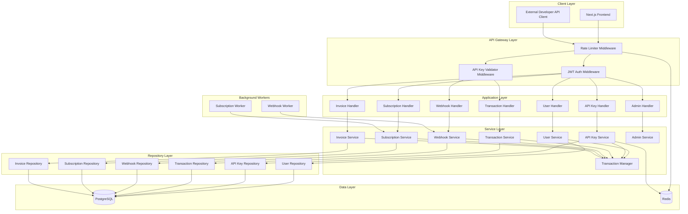
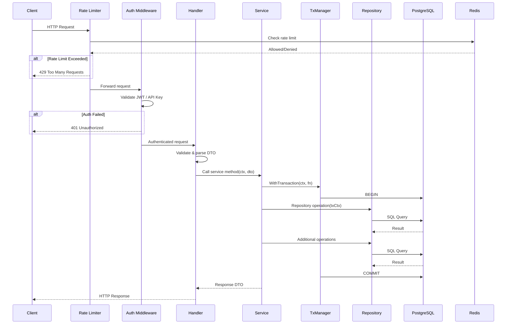
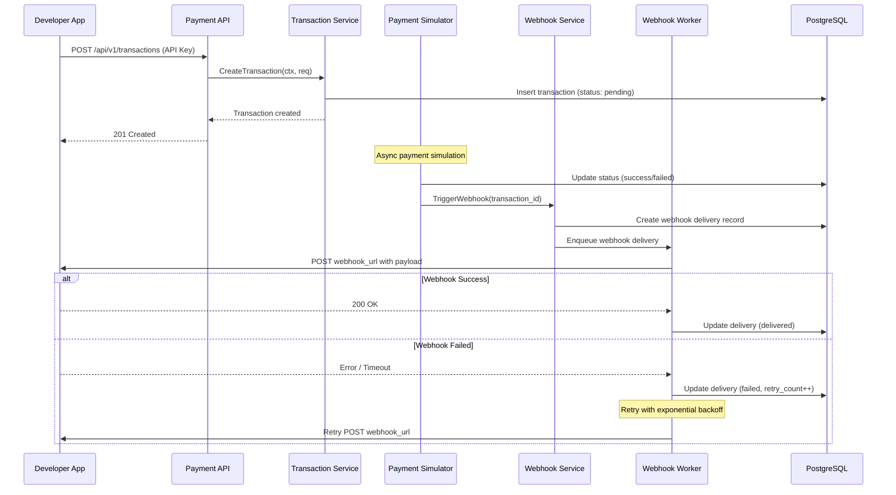
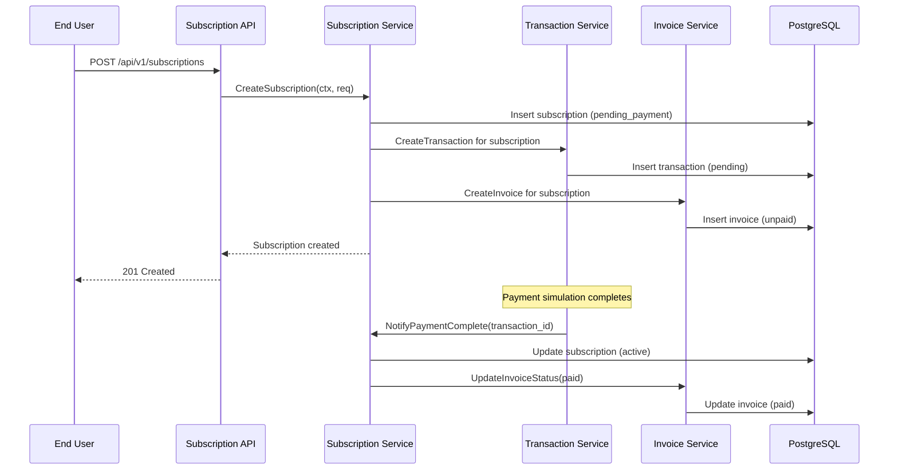
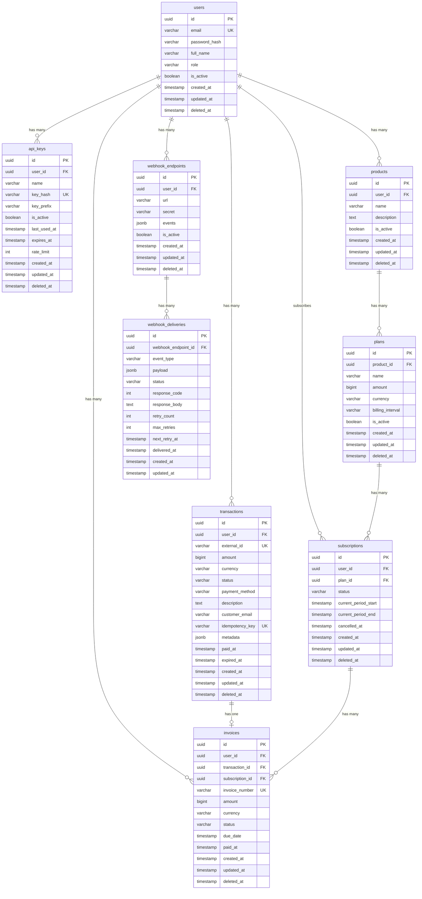

# Dokumen Desain: SaaS Payment Platform Setup

## Overview

SaaS Payment Platform adalah platform pembayaran terinspirasi dari Stripe dan Xendit yang menyediakan API untuk developer melakukan integrasi pembayaran. Platform ini mencakup autentikasi user berbasis JWT, manajemen API key, simulasi payment gateway, webhook notification dengan retry mechanism, subscription billing, invoice management, rate limiting berbasis Redis, dan admin dashboard untuk monitoring.

Arsitektur menggunakan pendekatan clean architecture dengan monorepo structure: backend Go + Fiber framework dan frontend Next.js + TypeScript. Database utama PostgreSQL untuk persistent storage dan Redis untuk caching serta rate limiting. Sistem dirancang untuk menangani 10K-100K user dengan availability 99.9% dan mematuhi standar PCI-DSS untuk keamanan data pembayaran.

Platform dibangun dalam 4 fase: MVP (auth, API key, transaksi, invoice dasar), Enhancement (webhook, subscription, tracking), Scale & Optimize (rate limiter, monitoring, dashboard, Docker/CI-CD), dan Advanced (idempotency, event-driven, audit log).

## Architecture

### System Architecture Overview




### Request Flow Sequence



### Payment Transaction Flow



### Subscription Billing Flow




## Components and Interfaces

### Struktur Proyek Monorepo

```
project-root/
├── backend/
│   ├── cmd/server/main.go                  # Entry point aplikasi
│   ├── internal/
│   │   ├── config/config.go                # Konfigurasi aplikasi
│   │   ├── handler/                        # HTTP handlers (Fiber)
│   │   │   ├── user_handler.go
│   │   │   ├── apikey_handler.go
│   │   │   ├── transaction_handler.go
│   │   │   ├── webhook_handler.go
│   │   │   ├── subscription_handler.go
│   │   │   ├── invoice_handler.go
│   │   │   └── admin_handler.go
│   │   ├── service/                        # Business logic
│   │   │   ├── user_service.go
│   │   │   ├── apikey_service.go
│   │   │   ├── transaction_service.go
│   │   │   ├── webhook_service.go
│   │   │   ├── subscription_service.go
│   │   │   ├── invoice_service.go
│   │   │   └── admin_service.go
│   │   ├── repository/                     # Database operations
│   │   │   ├── user_repository.go
│   │   │   ├── apikey_repository.go
│   │   │   ├── transaction_repository.go
│   │   │   ├── webhook_repository.go
│   │   │   ├── subscription_repository.go
│   │   │   └── invoice_repository.go
│   │   ├── model/                          # Domain models
│   │   │   ├── user.go
│   │   │   ├── apikey.go
│   │   │   ├── transaction.go
│   │   │   ├── webhook.go
│   │   │   ├── subscription.go
│   │   │   ├── invoice.go
│   │   │   └── product.go
│   │   ├── dto/                            # Request/Response DTOs
│   │   │   ├── user_dto.go
│   │   │   ├── apikey_dto.go
│   │   │   ├── transaction_dto.go
│   │   │   ├── webhook_dto.go
│   │   │   ├── subscription_dto.go
│   │   │   ├── invoice_dto.go
│   │   │   └── common_dto.go
│   │   ├── middleware/                     # Fiber middlewares
│   │   │   ├── auth_middleware.go
│   │   │   ├── apikey_middleware.go
│   │   │   ├── ratelimit_middleware.go
│   │   │   ├── cors_middleware.go
│   │   │   ├── logger_middleware.go
│   │   │   └── requestid_middleware.go
│   │   ├── worker/                         # Background workers
│   │   │   ├── webhook_worker.go
│   │   │   └── subscription_worker.go
│   │   └── pkg/                            # Internal shared packages
│   │       ├── database/postgres.go
│   │       ├── database/redis.go
│   │       ├── database/txmanager.go
│   │       ├── auth/jwt.go
│   │       ├── hash/bcrypt.go
│   │       ├── response/response.go
│   │       ├── validator/validator.go
│   │       └── logger/logger.go
│   ├── pkg/                                # Public shared packages
│   │   └── apierror/apierror.go
│   ├── migrations/                         # SQL migration files
│   ├── go.mod
│   ├── go.sum
│   ├── Makefile
│   └── Dockerfile
├── frontend/
│   ├── src/
│   │   ├── app/                            # Next.js App Router
│   │   │   ├── (auth)/login/page.tsx
│   │   │   ├── (auth)/register/page.tsx
│   │   │   ├── dashboard/page.tsx
│   │   │   ├── api-keys/page.tsx
│   │   │   ├── transactions/page.tsx
│   │   │   ├── webhooks/page.tsx
│   │   │   ├── subscriptions/page.tsx
│   │   │   ├── invoices/page.tsx
│   │   │   └── admin/page.tsx
│   │   ├── components/                     # Reusable UI components
│   │   ├── services/                       # API service layer
│   │   ├── types/                          # TypeScript type definitions
│   │   ├── utils/                          # Utility functions
│   │   └── hooks/                          # Custom React hooks
│   ├── package.json
│   ├── tsconfig.json
│   └── Dockerfile
├── reports/                                # Gitignored - auto-generated
│   ├── backend/
│   └── frontend/
├── docker-compose.yml
├── .github/workflows/ci.yml
├── kiro/
├── README.md
└── project_intake.yaml
```

### Komponen 1: Auth Middleware

**Tujuan**: Memvalidasi JWT token dan API key pada setiap request yang membutuhkan autentikasi.

```go
// internal/middleware/auth_middleware.go

type AuthMiddleware struct {
    jwtService auth.JWTService
    userRepo   repository.UserRepository
}

// JWTProtected memvalidasi Bearer token dari header Authorization
func (m *AuthMiddleware) JWTProtected() fiber.Handler

// AdminOnly memvalidasi bahwa user memiliki role admin
func (m *AuthMiddleware) AdminOnly() fiber.Handler
```

```go
// internal/middleware/apikey_middleware.go

type APIKeyMiddleware struct {
    apiKeyRepo repository.APIKeyRepository
    redisCache *redis.Client
}

// ValidateAPIKey memvalidasi X-API-Key header dan mencatat usage
func (m *APIKeyMiddleware) ValidateAPIKey() fiber.Handler
```

**Tanggung Jawab**:
- Ekstraksi dan validasi JWT token dari header Authorization
- Ekstraksi dan validasi API key dari header X-API-Key
- Injeksi user context (user_id, role) ke request context
- Pencatatan API key usage ke Redis untuk rate limiting
- Penolakan request yang tidak terautentikasi dengan 401

### Komponen 2: Transaction Manager

**Tujuan**: Mengelola database transaction di service layer sesuai clean architecture.

```go
// internal/pkg/database/txmanager.go

type TransactionManager interface {
    WithTransaction(ctx context.Context, fn func(ctx context.Context) error) error
}

type txManager struct {
    db *gorm.DB
}

func NewTransactionManager(db *gorm.DB) TransactionManager
```

**Tanggung Jawab**:
- Memulai database transaction
- Menyimpan transaction ke context untuk digunakan repository
- Commit jika semua operasi sukses
- Rollback jika ada error atau panic
- Deteksi nested transaction untuk mencegah double-begin

### Komponen 3: Webhook Worker

**Tujuan**: Background worker yang mengirimkan webhook notification secara asynchronous dengan retry mechanism.

```go
// internal/worker/webhook_worker.go

type WebhookWorker struct {
    webhookService service.WebhookService
    httpClient     *http.Client
    maxRetries     int
    logger         *slog.Logger
}

func NewWebhookWorker(ws service.WebhookService, maxRetries int) *WebhookWorker

// Start memulai worker loop yang memproses webhook delivery queue
func (w *WebhookWorker) Start(ctx context.Context) error

// Stop menghentikan worker secara graceful
func (w *WebhookWorker) Stop() error
```

**Tanggung Jawab**:
- Polling webhook delivery queue dari database
- Mengirim HTTP POST ke webhook URL milik developer
- Retry dengan exponential backoff (1s, 2s, 4s, 8s, 16s) jika gagal
- Update status delivery (delivered/failed) di database
- Graceful shutdown saat menerima signal

### Komponen 4: Rate Limiter

**Tujuan**: Membatasi jumlah request API berdasarkan API key menggunakan Redis sliding window.

```go
// internal/middleware/ratelimit_middleware.go

type RateLimiter struct {
    redisClient *redis.Client
    limit       int
    window      time.Duration
}

func NewRateLimiter(redisClient *redis.Client, limit int, window time.Duration) *RateLimiter

// Limit mengembalikan Fiber middleware yang menerapkan rate limiting
func (rl *RateLimiter) Limit() fiber.Handler
```

**Tanggung Jawab**:
- Implementasi sliding window counter menggunakan Redis MULTI/EXEC
- Identifikasi client berdasarkan API key atau IP address
- Return 429 Too Many Requests dengan header Retry-After jika limit terlampaui
- Menambahkan header X-RateLimit-Limit, X-RateLimit-Remaining, X-RateLimit-Reset


## Data Models

### Model 1: User

```go
// internal/model/user.go

type UserRole string

const (
    RoleAdmin     UserRole = "admin"
    RoleDeveloper UserRole = "developer"
    RoleEndUser   UserRole = "end_user"
)

type User struct {
    ID           uuid.UUID      `gorm:"type:uuid;primary_key;default:gen_random_uuid()"`
    Email        string         `gorm:"type:varchar(255);uniqueIndex;not null"`
    PasswordHash string         `gorm:"type:varchar(255);not null"`
    FullName     string         `gorm:"type:varchar(255);not null"`
    Role         UserRole       `gorm:"type:varchar(20);not null;default:'developer'"`
    IsActive     bool           `gorm:"not null;default:true"`
    CreatedAt    time.Time      `gorm:"not null;default:now()"`
    UpdatedAt    time.Time      `gorm:"not null;default:now()"`
    DeletedAt    gorm.DeletedAt `gorm:"index"`
}
```

**Aturan Validasi**:
- Email harus format valid dan unik
- Password minimal 8 karakter, harus di-hash dengan bcrypt
- Role harus salah satu dari: admin, developer, end_user
- Soft delete menggunakan deleted_at

### Model 2: APIKey

```go
// internal/model/apikey.go

type APIKey struct {
    ID         uuid.UUID      `gorm:"type:uuid;primary_key;default:gen_random_uuid()"`
    UserID     uuid.UUID      `gorm:"type:uuid;not null;index"`
    Name       string         `gorm:"type:varchar(100);not null"`
    KeyHash    string         `gorm:"type:varchar(255);not null;uniqueIndex"`
    KeyPrefix  string         `gorm:"type:varchar(12);not null"`
    IsActive   bool           `gorm:"not null;default:true"`
    LastUsedAt *time.Time
    ExpiresAt  *time.Time
    RateLimit  int            `gorm:"not null;default:1000"`
    CreatedAt  time.Time      `gorm:"not null;default:now()"`
    UpdatedAt  time.Time      `gorm:"not null;default:now()"`
    DeletedAt  gorm.DeletedAt `gorm:"index"`

    User User `gorm:"foreignKey:UserID"`
}
```

**Aturan Validasi**:
- API key di-hash sebelum disimpan (hanya ditampilkan sekali saat pembuatan)
- KeyPrefix disimpan untuk identifikasi tanpa expose full key (format: sk_test_xxxx)
- Rate limit default 1000 requests/hour, configurable per key
- Foreign key ke users table

### Model 3: Transaction

```go
// internal/model/transaction.go

type TransactionStatus string

const (
    TxStatusPending TransactionStatus = "pending"
    TxStatusSuccess TransactionStatus = "success"
    TxStatusFailed  TransactionStatus = "failed"
    TxStatusExpired TransactionStatus = "expired"
)

type PaymentMethod string

const (
    PMBankTransfer PaymentMethod = "bank_transfer"
    PMCreditCard   PaymentMethod = "credit_card"
    PMEWallet      PaymentMethod = "e_wallet"
    PMQRCode       PaymentMethod = "qr_code"
)

type Transaction struct {
    ID             uuid.UUID         `gorm:"type:uuid;primary_key;default:gen_random_uuid()"`
    UserID         uuid.UUID         `gorm:"type:uuid;not null;index"`
    ExternalID     string            `gorm:"type:varchar(255);not null;uniqueIndex"`
    Amount         int64             `gorm:"not null"`
    Currency       string            `gorm:"type:varchar(3);not null;default:'IDR'"`
    Status         TransactionStatus `gorm:"type:varchar(20);not null;default:'pending'"`
    PaymentMethod  PaymentMethod     `gorm:"type:varchar(30);not null"`
    Description    string            `gorm:"type:text"`
    CustomerEmail  string            `gorm:"type:varchar(255)"`
    IdempotencyKey *string           `gorm:"type:varchar(255);uniqueIndex"`
    Metadata       datatypes.JSON    `gorm:"type:jsonb"`
    PaidAt         *time.Time
    ExpiredAt      *time.Time
    CreatedAt      time.Time         `gorm:"not null;default:now()"`
    UpdatedAt      time.Time         `gorm:"not null;default:now()"`
    DeletedAt      gorm.DeletedAt    `gorm:"index"`

    User User `gorm:"foreignKey:UserID"`
}
```

**Aturan Validasi**:
- Amount harus positif, disimpan dalam satuan terkecil (cents/rupiah)
- ExternalID unik per developer untuk referensi eksternal
- IdempotencyKey opsional, unik jika diisi (Phase 4)
- Status transition: pending → success/failed/expired
- Metadata berformat JSONB untuk data tambahan fleksibel

### Model 4: WebhookEndpoint & WebhookDelivery

```go
// internal/model/webhook.go

type WebhookEndpoint struct {
    ID        uuid.UUID      `gorm:"type:uuid;primary_key;default:gen_random_uuid()"`
    UserID    uuid.UUID      `gorm:"type:uuid;not null;index"`
    URL       string         `gorm:"type:varchar(500);not null"`
    Secret    string         `gorm:"type:varchar(255);not null"` // untuk HMAC signature verification
    Events    datatypes.JSON `gorm:"type:jsonb;not null"`
    IsActive  bool           `gorm:"not null;default:true"`
    CreatedAt time.Time      `gorm:"not null;default:now()"`
    UpdatedAt time.Time      `gorm:"not null;default:now()"`
    DeletedAt gorm.DeletedAt `gorm:"index"`

    User User `gorm:"foreignKey:UserID"`
}

type DeliveryStatus string

const (
    DeliveryPending   DeliveryStatus = "pending"
    DeliveryDelivered DeliveryStatus = "delivered"
    DeliveryFailed    DeliveryStatus = "failed"
)

type WebhookDelivery struct {
    ID                uuid.UUID      `gorm:"type:uuid;primary_key;default:gen_random_uuid()"`
    WebhookEndpointID uuid.UUID      `gorm:"type:uuid;not null;index"`
    EventType         string         `gorm:"type:varchar(50);not null"`
    Payload           datatypes.JSON `gorm:"type:jsonb;not null"`
    Status            DeliveryStatus `gorm:"type:varchar(20);not null;default:'pending'"`
    ResponseCode      *int
    ResponseBody      *string        `gorm:"type:text"`
    RetryCount        int            `gorm:"not null;default:0"`
    MaxRetries        int            `gorm:"not null;default:5"`
    NextRetryAt       *time.Time     `gorm:"index"`
    DeliveredAt       *time.Time
    CreatedAt         time.Time      `gorm:"not null;default:now()"`
    UpdatedAt         time.Time      `gorm:"not null;default:now()"`

    WebhookEndpoint WebhookEndpoint `gorm:"foreignKey:WebhookEndpointID"`
}
```

### Model 5: Product, Plan & Subscription

```go
// internal/model/product.go

type Product struct {
    ID          uuid.UUID      `gorm:"type:uuid;primary_key;default:gen_random_uuid()"`
    UserID      uuid.UUID      `gorm:"type:uuid;not null;index"`
    Name        string         `gorm:"type:varchar(255);not null"`
    Description string         `gorm:"type:text"`
    IsActive    bool           `gorm:"not null;default:true"`
    CreatedAt   time.Time      `gorm:"not null;default:now()"`
    UpdatedAt   time.Time      `gorm:"not null;default:now()"`
    DeletedAt   gorm.DeletedAt `gorm:"index"`

    User  User   `gorm:"foreignKey:UserID"`
    Plans []Plan `gorm:"foreignKey:ProductID"`
}
```

```go
// internal/model/subscription.go

type BillingInterval string

const (
    BillingMonthly BillingInterval = "monthly"
    BillingYearly  BillingInterval = "yearly"
)

type Plan struct {
    ID              uuid.UUID       `gorm:"type:uuid;primary_key;default:gen_random_uuid()"`
    ProductID       uuid.UUID       `gorm:"type:uuid;not null;index"`
    Name            string          `gorm:"type:varchar(255);not null"`
    Amount          int64           `gorm:"not null"`
    Currency        string          `gorm:"type:varchar(3);not null;default:'IDR'"`
    BillingInterval BillingInterval `gorm:"type:varchar(20);not null"`
    IsActive        bool            `gorm:"not null;default:true"`
    CreatedAt       time.Time       `gorm:"not null;default:now()"`
    UpdatedAt       time.Time       `gorm:"not null;default:now()"`
    DeletedAt       gorm.DeletedAt  `gorm:"index"`

    Product Product `gorm:"foreignKey:ProductID"`
}

type SubscriptionStatus string

const (
    SubStatusPendingPayment SubscriptionStatus = "pending_payment"
    SubStatusActive         SubscriptionStatus = "active"
    SubStatusCancelled      SubscriptionStatus = "cancelled"
    SubStatusExpired        SubscriptionStatus = "expired"
)

type Subscription struct {
    ID                 uuid.UUID          `gorm:"type:uuid;primary_key;default:gen_random_uuid()"`
    UserID             uuid.UUID          `gorm:"type:uuid;not null;index"`
    PlanID             uuid.UUID          `gorm:"type:uuid;not null;index"`
    Status             SubscriptionStatus `gorm:"type:varchar(30);not null;default:'pending_payment'"`
    CurrentPeriodStart time.Time          `gorm:"not null"`
    CurrentPeriodEnd   time.Time          `gorm:"not null"`
    CancelledAt        *time.Time
    CreatedAt          time.Time          `gorm:"not null;default:now()"`
    UpdatedAt          time.Time          `gorm:"not null;default:now()"`
    DeletedAt          gorm.DeletedAt     `gorm:"index"`

    User User `gorm:"foreignKey:UserID"`
    Plan Plan `gorm:"foreignKey:PlanID"`
}
```

### Model 6: Invoice

```go
// internal/model/invoice.go

type InvoiceStatus string

const (
    InvoiceUnpaid InvoiceStatus = "unpaid"
    InvoicePaid   InvoiceStatus = "paid"
    InvoiceVoid   InvoiceStatus = "void"
)

type Invoice struct {
    ID             uuid.UUID      `gorm:"type:uuid;primary_key;default:gen_random_uuid()"`
    UserID         uuid.UUID      `gorm:"type:uuid;not null;index"`
    TransactionID  *uuid.UUID     `gorm:"type:uuid;index"`
    SubscriptionID *uuid.UUID     `gorm:"type:uuid;index"`
    InvoiceNumber  string         `gorm:"type:varchar(50);not null;uniqueIndex"`
    Amount         int64          `gorm:"not null"`
    Currency       string         `gorm:"type:varchar(3);not null;default:'IDR'"`
    Status         InvoiceStatus  `gorm:"type:varchar(20);not null;default:'unpaid'"`
    DueDate        time.Time      `gorm:"not null"`
    PaidAt         *time.Time
    CreatedAt      time.Time      `gorm:"not null;default:now()"`
    UpdatedAt      time.Time      `gorm:"not null;default:now()"`
    DeletedAt      gorm.DeletedAt `gorm:"index"`

    User         User          `gorm:"foreignKey:UserID"`
    Transaction  *Transaction  `gorm:"foreignKey:TransactionID"`
    Subscription *Subscription `gorm:"foreignKey:SubscriptionID"`
}
```

**Aturan Validasi**:
- InvoiceNumber auto-generated dengan format: INV-YYYYMMDD-XXXXX
- Invoice bisa terkait dengan Transaction ATAU Subscription (salah satu)
- Status transition: unpaid → paid/void

### Database Schema Diagram


